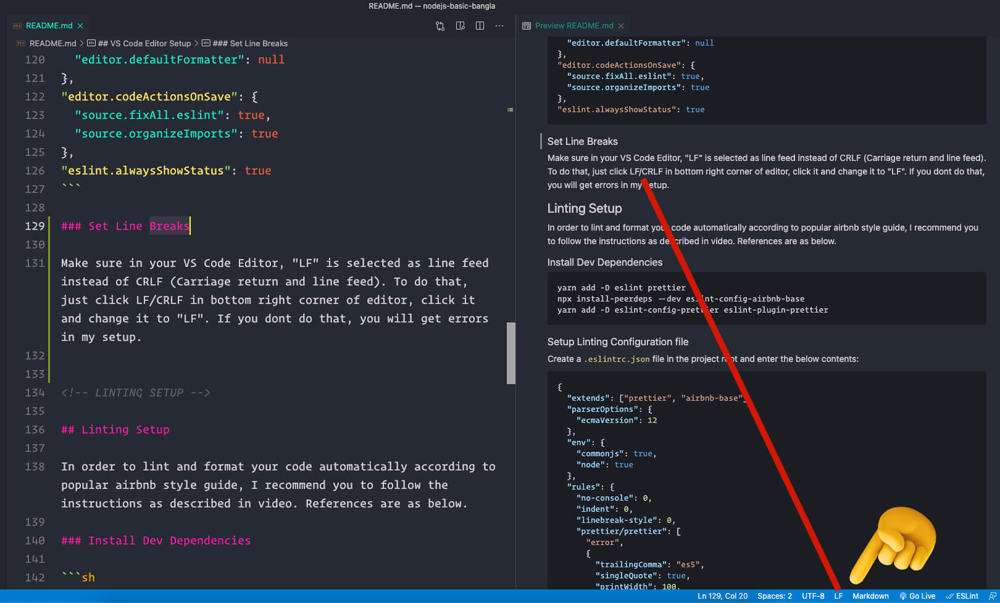

[](https://www.linkedin.com/in/manikislammahi/)
[](https://www.facebook.com/manikislammahi/)
[](https://twitter.com/ManikIslamMahi)

<!-- PROJECT LOGO -->
<br />
<p align="center">
  <a href="https://github.com/learnwithsumit/nodejs-basic-bangla">
    
  </a>
  <h1 align="center">Node.js in depth</h1>

<!-- TABLE OF CONTENTS -->

- [Install and Update Node](#install-and-update-node)
  - [Arch Linux](#arch-linux)
  - [Windows](#windows)
- [Update yarn](#update-yarn)
  - [On Arch Linux](#on-arch-linux)
  - [On Windows](#on-windows)
- [VS Code Editor Setup](#vs-code-editor-setup)
  - [Extensions](#extensions)
  - [Settings](#settings)
  - [Set Line Breaks](#set-line-breaks)
- [Linting Setup](#linting-setup)
  - [Install Dev Dependencies](#install-dev-dependencies)
  - [Setup Linting Configuration file](#setup-linting-configuration-file)
- [Contact](#contact)

<!-- UPDATE NODE -->

## Install and Update Node

Please follow the below instructions to update node in your machine:

### Arch Linux

Install Node Version Manager.

1. Update Your System
   ```sh
   sudo pacman -Syu
   ```
2. Clone this repository in your home directory
   ```sh
   https://aur.archlinux.org/nvm.git
   ```
3. Access this nvm directory from your konsole/terminal

   ```sh
   cd nvm

   => then press: tab key
   => and then press: enter key
   ```

4. Copy this below text and got to your home directory. Then make sure you can see your hidden fiels. Then open your `.bashrc` file and past it on the bottom line.
   ```sh
   source /usr/share/nvm/init-nvm.sh
   ```
5. Check which versions are available now
   ```sh
   nvm ls-remote
   ```
6. Install a node version which you want
   ```sh
   nvm install yourVersionNumber
   ```

### Windows

1. Update npm
   ```sh
   npm install npm@latest -g
   ```
2. Clear npm cache
   ```sh
   npm cache clean -f
   ```
3. Install n
   ```sh
   npm install -g n
   ```
4. Update node to latest version
   ```sh
   n latest
   ```

<!-- INSTALL & UPDATE YARN -->

## Update yarn

Please follow the below instructions to install or update yarn in your machine.

### On Arch Linux

1. Install yarn
   ```sh
   sudo pacman -Syu
   sudo pacman -S yarn
   ```
2. Update yarn
   ```sh
   sudo pacman -Syu
   ```

### On Windows

1. Install yarn
   ```sh
   npm install -g yarn
   ```
2. Update yarn
   ```sh
   yarn set version latest
   ```

<!-- EDITOR SETUP -->

## VS Code Editor Setup

In order to follow along the tutorial series, I recommend you to use Visual Studio Code Editor and install & apply the below extensions and settings.

### Extensions

Install the below extensions:

- [ESLint](https://marketplace.visualstudio.com/items?itemName=dbaeumer.vscode-eslint)
- [Prettier](https://marketplace.visualstudio.com/items?itemName=esbenp.prettier-vscode)
- [Path Autocomplete](https://marketplace.visualstudio.com/items?itemName=ionutvmi.path-autocomplete)

### Settings

Go to your Visual Stuido Code `settings.json` file and add the below settings there:

```json
// config related to code formatting
"editor.defaultFormatter": "esbenp.prettier-vscode",
"editor.formatOnSave": true,
"[javascript]": {
  "editor.formatOnSave": false,
  "editor.defaultFormatter": null
},
"editor.codeActionsOnSave": {
  "source.fixAll.eslint": true,
  "source.organizeImports": true
},
"eslint.alwaysShowStatus": true
```

### Set Line Breaks

Make sure in your VS Code Editor, "LF" is selected as line feed instead of CRLF (Carriage return and line feed). To do that, just click LF/CRLF in bottom right corner of editor, click it and change it to "LF". If you dont do that, you will get errors in my setup.



<!-- LINTING SETUP -->

## Linting Setup

In order to lint and format your code automatically according to popular airbnb style guide, I recommend you to follow the instructions as described in video. References are as below.

### Install Dev Dependencies

```sh
yarn add -D eslint prettier
npx install-peerdeps --dev eslint-config-airbnb-base
yarn add -D eslint-config-prettier eslint-plugin-prettier
```

### Setup Linting Configuration file

Create a `.eslintrc.json` file in the project root and enter the below contents:

```json
{
  "extends": ["prettier", "airbnb-base"],
  "parserOptions": {
    "ecmaVersion": 12
  },
  "env": {
    "commonjs": true,
    "node": true
  },
  "rules": {
    "no-console": 0,
    "indent": 0,
    "linebreak-style": 0,
    "prettier/prettier": [
      "error",
      {
        "trailingComma": "es5",
        "singleQuote": true,
        "printWidth": 100,
        "tabWidth": 4,
        "semi": true
      }
    ]
  },
  "plugins": ["prettier"]
}
```

<!-- CONTACT -->

## Contact

[LinkedIn](https://www.linkedin.com/in/manikislammahi/)

[Twitter](https://twitter.com/ManikIslamMahi)

[Facebook](https://www.facebook.com/manikislammahi/)
